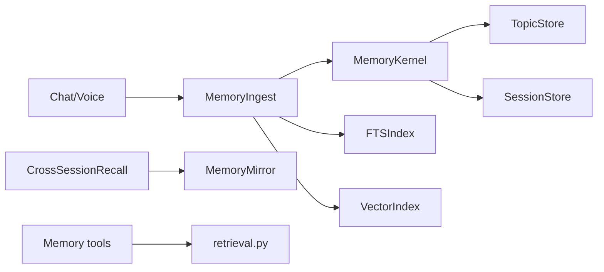

# Memory Pipeline Flow

## Files (order)

1. `providers/memory/ingest.py`
2. `providers/memory/kernel.py`
3. `providers/memory/index.py`, `search.py`
4. `providers/memory/mirror.py`, `retrieval.py`
5. `capabilities/tools/memory.py`

## Related docs

- [INDEX](../../INDEX.md)
- [AI_INSTRUCTIONS](../../AI_INSTRUCTIONS.md)
- [overview](../overview.md)
- [architecture-layers](../../00-meta/architecture-layers.md)
- [memory](../../04-capabilities/tools/memory.md)
- [setup-flow](../../01-entry-points/setup-flow.md)
- [windows-launchers](../../01-entry-points/windows-launchers.md)
- [bundle-offline](../../02-kernel/bundle-offline.md)
- [process-map](../../maps/process-map.md)
- [env-reference](../../07-config/env-reference.md)

- **Last reviewed:** 2026-08-13 (jarvis-os @ local)
