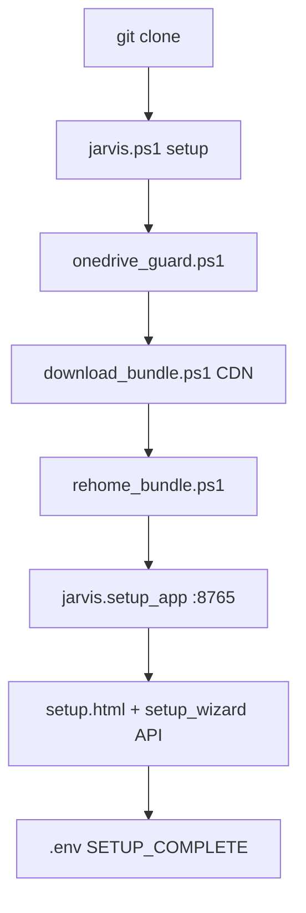
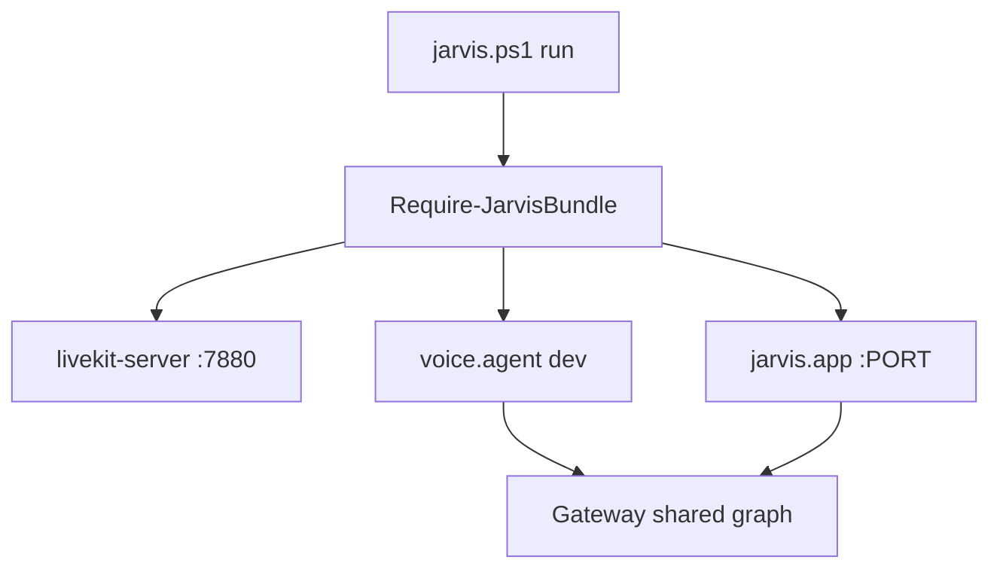
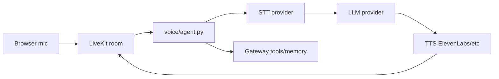

# Process Map — Setup, Run, Voice, Chat

## Setup flow

**Files (order):** `jarvis.ps1` → `scripts/onedrive_guard.ps1` → `scripts/download_bundle.ps1` → `scripts/release/rehome_bundle.ps1` → `jarvis.setup_app` → `interfaces/ui/static/setup.html` → `interfaces/api/setup_wizard.py`

**Failure modes:** OneDrive install path blocked; bundle missing; port 8765 in use. See [09-operations/troubleshooting.md](../09-operations/troubleshooting.md).

## Run flow

**Files:** `jarvis.ps1`, `jarvis.app`, `interfaces/voice/agent.py`, `bootstrap.py`

## Voice pipeline (LiveKit)

See [06-interfaces/voice-livekit.md](../06-interfaces/voice-livekit.md).

## Chat flow

## Related docs

- [INDEX](../INDEX.md)
- [AI_INSTRUCTIONS](../AI_INSTRUCTIONS.md)
- [setup-flow](../01-entry-points/setup-flow.md)
- [windows-launchers](../01-entry-points/windows-launchers.md)
- [bundle-offline](../02-kernel/bundle-offline.md)
- [env-reference](../07-config/env-reference.md)
- [run-flow](../01-entry-points/run-flow.md)
- [logs-and-doctor](../09-operations/logs-and-doctor.md)
- [troubleshooting](../09-operations/troubleshooting.md)
- [release-and-bundle](../09-operations/release-and-bundle.md)

- **Last reviewed:** 2026-08-13 (jarvis-os @ local)
